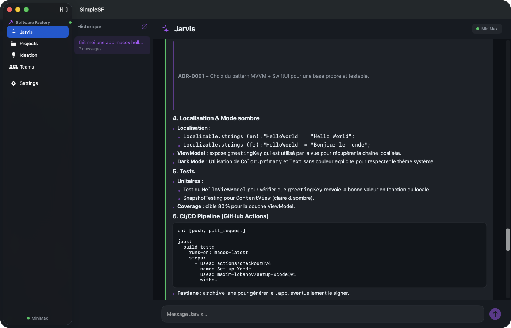
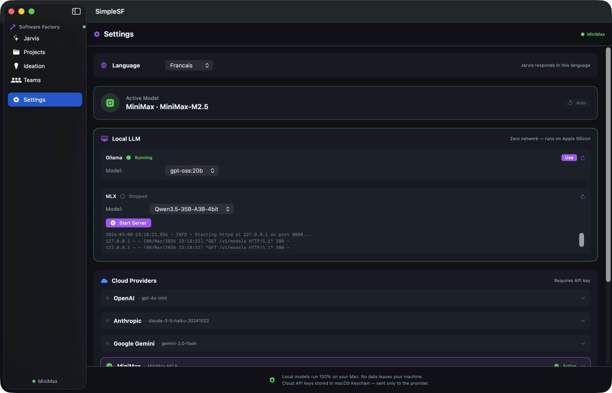

<p align="center">
  
</p>

<h1 align="center">Simple Software Factory</h1>

<p align="center">
  <strong>A native macOS multi-agent AI app — no server, no Docker, zero config.</strong><br/>
  SwiftUI · Rust FFI · 10 LLM providers · 22 AI agents · Dark mode
</p>

<p align="center">
  🌍 <a href="#english">English</a> · <a href="#français">Français</a> · <a href="#español">Español</a> · <a href="#deutsch">Deutsch</a> · <a href="#中文">中文</a> · <a href="#日本語">日本語</a> · <a href="#한국어">한국어</a> · <a href="#العربية">العربية</a> · <a href="#português">Português</a> · <a href="#italiano">Italiano</a>
</p>

---

## English

**Simple Software Factory** is a native macOS app that runs a complete multi-agent AI software factory — entirely offline, on your Mac. No server, no Docker, no cloud required. Just build and run.

Agents collaborate in real-time discussions (network pattern) with distinct roles (RTE, Architect, Lead Dev, Product Owner), producing rich markdown output with tables, code blocks, and structured deliverables.

### Screenshots

| Jarvis Chat — Agent Discussion | Settings — Model Selector |
|:---:|:---:|
|  |  |

### Features

- **Jarvis AI Assistant** — chat with context-aware AI that orchestrates multi-agent discussions
- **Multi-Agent Discussions** — 22 agents with real personas, avatars, roles, and colored cards
- **Rich Markdown Rendering** — headers, bold, lists, tables, code blocks, blockquotes — all native SwiftUI
- **10 LLM Providers** — Ollama · MLX · OpenAI · Anthropic · Gemini · MiniMax · Kimi · OpenRouter · Alibaba Qwen · Zhipu GLM
- **Model Selector** — pick any provider + model, override defaults, switch with one click
- **Local-First** — Ollama and MLX run 100% on your Mac, zero data leaves your machine
- **Dark Mode** — GitHub Dark color palette, designed for long coding sessions
- **12 Languages** — French, English, Spanish, German, Italian, Portuguese, Japanese, Korean, Chinese, Arabic, Russian, Dutch
- **Chat History** — sessions persist across restarts with full agent metadata

### Architecture

```
SimpleSF.app
├── MacOS/SimpleSF                 Swift binary (SwiftUI)
├── Resources/
│   └── SimpleSF_SimpleSF.bundle/
│       └── Avatars/               Agent photos (22 JPG)
└── Frameworks/
    └── libsf_engine.a             Rust static library (C FFI)
```

**Tech stack:** Swift 6 + SwiftUI → C FFI (`@_silgen_name`) → Rust `staticlib` (~30 MB `.a`).  
The Rust engine handles LLM calls, agent orchestration, and the discussion protocol.  
Swift handles UI, persistence, and provider management.

### Quick Start

```bash
git clone https://github.com/macaron-software/simple-sf.git
cd simple-sf

# Build the Rust engine
cd SFEngine && cargo build --release && cd ..

# Build the Swift app
xcrun swift build

# Bundle as .app
mkdir -p dist/SimpleSF.app/Contents/{MacOS,Resources}
cp .build/arm64-apple-macosx/debug/SimpleSF dist/SimpleSF.app/Contents/MacOS/
cp -R .build/arm64-apple-macosx/debug/SimpleSF_SimpleSF.bundle dist/SimpleSF.app/Contents/Resources/
codesign --force --sign - dist/SimpleSF.app

# Launch
open dist/SimpleSF.app
```

### Requirements

- macOS 14 (Sonoma) or later
- Rust 1.75+ (for the engine)
- Xcode 15+ / Swift 5.9+ (for the UI)
- At least one LLM provider: local (Ollama or MLX) or cloud API key

### Project Structure

```
simple-sf/
├── Package.swift              SPM manifest (links Rust .a)
├── SimpleSF/
│   ├── App/                   AppState, main entry
│   ├── Engine/                SFBridge (Swift↔Rust FFI)
│   ├── Jarvis/                Chat UI, agent cards
│   ├── LLM/                   LLMService, providers, Keychain
│   ├── Onboarding/            Settings, setup wizard
│   ├── Data/                  ChatStore (JSON persistence)
│   ├── Views/Shared/          DesignTokens, MarkdownView, avatars
│   └── Resources/Avatars/     22 agent photos
├── SFEngine/
│   ├── src/engine.rs          Discussion orchestrator
│   ├── src/llm.rs             Multi-provider LLM client
│   ├── src/ffi.rs             C FFI exports
│   └── Cargo.toml             Rust dependencies
└── docs/screenshots/          App screenshots
```

---

## Français

**Simple Software Factory** est une application macOS native qui exécute une usine logicielle multi-agents IA — entièrement hors-ligne, sur votre Mac. Aucun serveur, Docker ou cloud nécessaire.

Les agents collaborent en discussions temps réel (pattern network) avec des rôles distincts (RTE, Architecte, Lead Dev, Product Owner), produisant du contenu riche en markdown : tableaux, blocs de code, livrables structurés.

### Captures d'écran

| Chat Jarvis — Discussion d'agents | Réglages — Sélecteur de modèle |
|:---:|:---:|
|  |  |

### Fonctionnalités

- **Assistant IA Jarvis** — chat avec IA contextuelle orchestrant des discussions multi-agents
- **Discussions Multi-Agents** — 22 agents avec personas, avatars, rôles et cartes colorées
- **Rendu Markdown Natif** — titres, gras, listes, tableaux, blocs de code, citations — tout en SwiftUI natif
- **10 Fournisseurs LLM** — Ollama · MLX · OpenAI · Anthropic · Gemini · MiniMax · Kimi · OpenRouter · Alibaba Qwen · Zhipu GLM
- **Sélecteur de Modèle** — choisissez un fournisseur + modèle, changez en un clic
- **Local-First** — Ollama et MLX tournent 100% sur votre Mac, aucune donnée ne sort
- **Mode Sombre** — palette GitHub Dark, pensée pour les longues sessions
- **12 Langues** — français, anglais, espagnol, allemand, italien, portugais, japonais, coréen, chinois, arabe, russe, néerlandais

### Démarrage Rapide

```bash
git clone https://github.com/macaron-software/simple-sf.git
cd simple-sf
cd SFEngine && cargo build --release && cd ..
xcrun swift build
# Voir la section English pour le bundling .app complet
open dist/SimpleSF.app
```

### Prérequis

- macOS 14 (Sonoma) ou ultérieur
- Rust 1.75+ · Xcode 15+ / Swift 5.9+
- Au moins un fournisseur LLM : local (Ollama ou MLX) ou clé API cloud

---

## Español

**Simple Software Factory** es una aplicación macOS nativa que ejecuta una fábrica de software multi-agente IA — completamente offline, en tu Mac.

### Capturas de Pantalla

| Chat Jarvis | Configuración — Selector de Modelo |
|:---:|:---:|
|  |  |

### Características

- **Asistente IA Jarvis** — chat con orquestación multi-agente
- **22 Agentes IA** — con avatares, roles y tarjetas de colores
- **Renderizado Markdown** — tablas, bloques de código, listas — todo nativo SwiftUI
- **10 Proveedores LLM** — Ollama · MLX · OpenAI · Anthropic · Gemini · MiniMax y más
- **Local-First** — los modelos locales funcionan 100% en tu Mac
- **Modo Oscuro** — paleta GitHub Dark

### Inicio Rápido

```bash
git clone https://github.com/macaron-software/simple-sf.git
cd simple-sf && cd SFEngine && cargo build --release && cd ..
xcrun swift build && open dist/SimpleSF.app
```

---

## Deutsch

**Simple Software Factory** ist eine native macOS-App, die eine komplette Multi-Agenten-KI-Softwarefabrik ausführt — vollständig offline auf Ihrem Mac.

### Funktionen

- **Jarvis KI-Assistent** — Chat mit Multi-Agenten-Orchestrierung
- **22 KI-Agenten** — mit Avataren, Rollen und farbigen Karten
- **Markdown-Rendering** — Tabellen, Code-Blöcke, Listen — alles natives SwiftUI
- **10 LLM-Anbieter** — Ollama · MLX · OpenAI · Anthropic · Gemini · MiniMax und mehr
- **Local-First** — lokale Modelle laufen 100% auf Ihrem Mac

| Jarvis Chat | Einstellungen |
|:---:|:---:|
|  |  |

---

## 中文

**Simple Software Factory** 是一个原生 macOS 应用，在您的 Mac 上运行完整的多智能体 AI 软件工厂 — 完全离线，无需服务器。

### 功能特点

- **Jarvis AI 助手** — 多智能体协作对话
- **22 个 AI 智能体** — 带头像、角色和彩色卡片
- **原生 Markdown 渲染** — 表格、代码块、列表 — 全部原生 SwiftUI
- **10 个 LLM 提供商** — Ollama · MLX · OpenAI · Anthropic · Gemini · MiniMax 等
- **本地优先** — 本地模型 100% 在您的 Mac 上运行
- **暗色模式** — GitHub Dark 配色方案

| Jarvis 聊天 | 设置 |
|:---:|:---:|
|  |  |

---

## 日本語

**Simple Software Factory** は、Mac 上でマルチエージェント AI ソフトウェアファクトリーを実行するネイティブ macOS アプリです。サーバー不要、完全オフライン。

### 機能

- **Jarvis AI アシスタント** — マルチエージェント協調チャット
- **22 AI エージェント** — アバター、役割、カラーカード付き
- **ネイティブ Markdown レンダリング** — テーブル、コードブロック、リスト
- **10 LLM プロバイダー** — Ollama · MLX · OpenAI · Anthropic · Gemini · MiniMax 他
- **ローカルファースト** — ローカルモデルは Mac 上で 100% 動作

| Jarvis チャット | 設定 |
|:---:|:---:|
|  |  |

---

## 한국어

**Simple Software Factory**는 Mac에서 멀티 에이전트 AI 소프트웨어 팩토리를 실행하는 네이티브 macOS 앱입니다. 서버 불필요, 완전 오프라인.

### 기능

- **Jarvis AI 어시스턴트** — 멀티 에이전트 협업 채팅
- **22개 AI 에이전트** — 아바타, 역할, 컬러 카드
- **네이티브 Markdown 렌더링** — 테이블, 코드 블록, 목록
- **10개 LLM 제공업체** — Ollama · MLX · OpenAI · Anthropic · Gemini · MiniMax 등
- **로컬 우선** — 로컬 모델은 Mac에서 100% 실행

---

## العربية

**Simple Software Factory** هو تطبيق macOS أصلي يشغّل مصنع برمجيات متعدد الوكلاء بالذكاء الاصطناعي — بالكامل دون اتصال، على جهاز Mac الخاص بك.

### الميزات

- **مساعد Jarvis الذكي** — محادثة مع تنسيق متعدد الوكلاء
- **22 وكيل ذكاء اصطناعي** — مع صور رمزية وأدوار وبطاقات ملونة
- **عرض Markdown أصلي** — جداول وكتل برمجية وقوائم
- **10 مزودي نماذج لغوية** — Ollama · MLX · OpenAI · Anthropic · Gemini · MiniMax والمزيد
- **المحلي أولاً** — النماذج المحلية تعمل 100% على جهاز Mac

---

## Português

**Simple Software Factory** é um app macOS nativo que executa uma fábrica de software multi-agente IA — totalmente offline, no seu Mac.

### Funcionalidades

- **Assistente IA Jarvis** — chat com orquestração multi-agente
- **22 Agentes IA** — com avatares, papéis e cartões coloridos
- **Renderização Markdown Nativa** — tabelas, blocos de código, listas — tudo SwiftUI nativo
- **10 Provedores LLM** — Ollama · MLX · OpenAI · Anthropic · Gemini · MiniMax e mais
- **Local-First** — modelos locais rodam 100% no seu Mac

---

## Italiano

**Simple Software Factory** è un'app macOS nativa che esegue una software factory multi-agente IA — completamente offline, sul tuo Mac.

### Caratteristiche

- **Assistente IA Jarvis** — chat con orchestrazione multi-agente
- **22 Agenti IA** — con avatar, ruoli e schede colorate
- **Rendering Markdown Nativo** — tabelle, blocchi di codice, liste — tutto SwiftUI nativo
- **10 Provider LLM** — Ollama · MLX · OpenAI · Anthropic · Gemini · MiniMax e altri
- **Local-First** — i modelli locali girano al 100% sul tuo Mac

---

## License

This project is licensed under the AGPL v3 License - see the [LICENSE](LICENSE) file for details.
